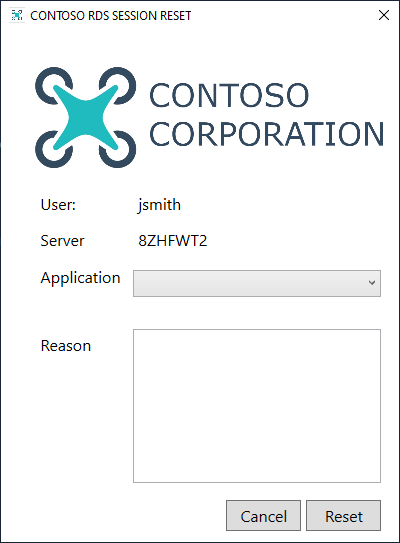
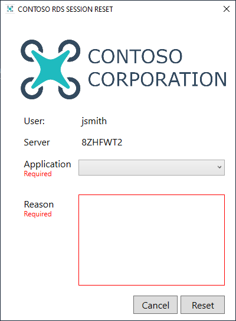

# Reset-Session

Simple script to let a user reset their RemoteApps session. GUI is done using XAML with WPF (Not windows forms).

## Requirements

* [PowerShell 5.0+](https://docs.microsoft.com/en-us/skypeforbusiness/set-up-your-computer-for-windows-powershell/download-and-install-windows-powershell-5-1) (It may work on other versions but this is what it is built with.)

## Setup

1. Change the details in the variable region at the top of the Reset-Session.ps1 script to suit your environment.
2. Change the email settings at the bottom of the script.
3. Copy the folder to each of the servers in your collection.

## Installation
   
1. Open Server Manager on the primary connection broker.
2. Choose "Remote Desktop Services.
3. Choose your desired collection under "Collections".
4. click the "Tasks" button to the right of the "RemoteApp Programs" heading and choose "Publish RemoteApp Programs".
5. Click the "Add" button.
6. Choose the PowerShell executable ("C:\Windows\System32\WindowsPowerShell\v1.0\powershell.exe").
7. Click "Next".
8. Click "Publish".
9.  Find PowerShell in the list and then right-click and choose "edit properties".
10. Change the "RemoteApp program name" to something friendly like "Reset Session Tool"
11. Choose "Parameters" from the left hand menu.
12. Choose "Always use the following command-line parameters"
13. Enter in the box: -ExecutionPolicy Bypass -WindowStyle Hidden -File "<LOCAL PATH OF YOUR PS1 FILE>"
14. Choose "OK"

## Screenshots

